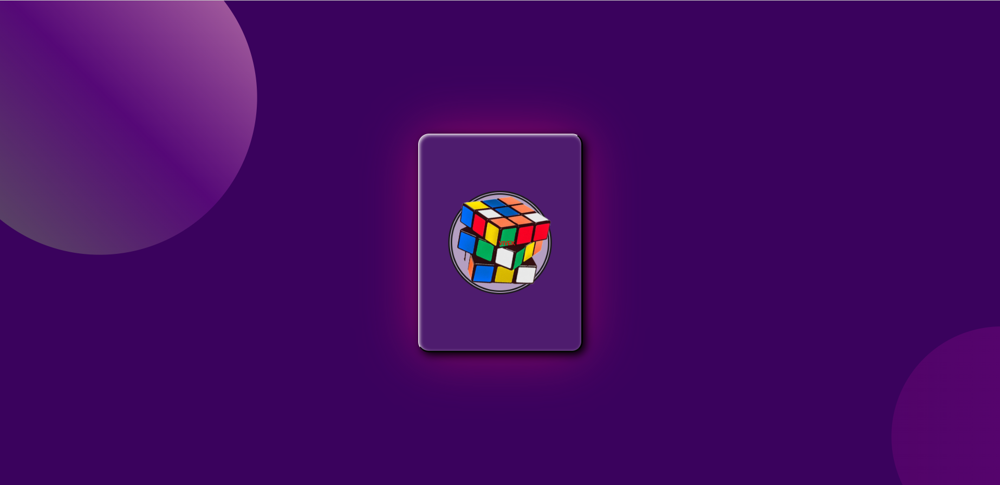
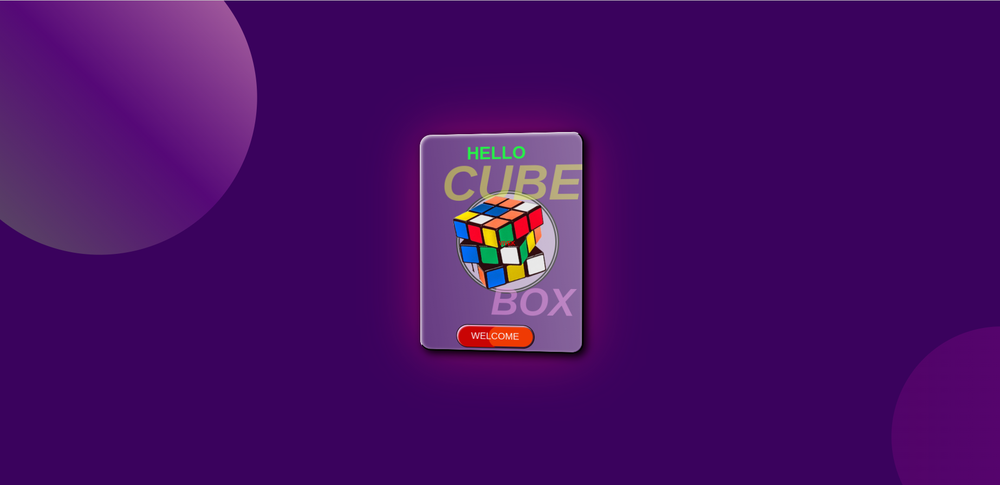

# Card Tilt Effect with 3D Perspective

This project demonstrates how to create a card tilt effect with a 3D perspective using HTML, CSS, and JavaScript.

## Preview
## [LIVE 👁️](https://card-tilt-3d.vercel.app/) 

## Demo
[](https://www.youtube.com/watch?v=NWF-0nPqmBM)

## How It Works

The project utilizes the following components:

- **HTML**: Defines the structure of the card and its contents.
- **CSS**: Adds styles for the card layout, tilt effect, and additional visual enhancements.
- **JavaScript**: Implements the tilt effect using the VanillaTilt library to add a dynamic 3D perspective to the card.

## Usage

1. Clone this repository to your local machine:
   ```bash
   git clone https://github.com/vivek20Eng/Card-tilt.git
   ```
2. Open the project directory in Visual Studio Code.
3. Use the Live Server extension to run the index.html file:
   - Install the Live Server extension if you haven't already.
   - Right-click on the index.html file in the project explorer.
   - Select <b>"Open with Live Server"</b> from the context menu.
4. Your default web browser should open automatically, displaying the card tilt effect in action.

## Screenshots

